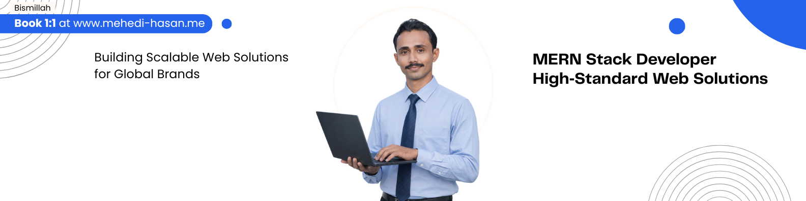

<!-- 

  

 -->

# Hi, I’m Mehedi Hasan 

📍 **Bangladesh** | ⚛️ **Frontend-Focused Full Stack Engineer** | 🚀 **MERN & Next.js Developer**

> I build **scalable, user-centric web applications**.  
> Specialized in **React & Next.js** for frontend, with strong **backend experience** in APIs, authentication, and databases.  
> Open to **full-time frontend & full-stack opportunities**.

---

## 🌟 Featured Projects

- **[🌱 Plant Care Tracker](https://plant-care-tracker-bd.web.app)** – MERN app for managing plant routines, reminders, and notes.  
- **[🍽️ Food Garden](https://food-garden-bd.web.app/)** – Real-time food management platform with Firebase auth & sync.  
- **[📡 Duranta Online](https://duranta-online.vercel.app/)** – Next.js app for internet & cable services with admin dashboard.  
- **[✅ Task Manager](https://meheditodo.vercel.app/)** – Next.js & TypeScript app to create, update, and organize tasks with real-time updates.  
- **[🎯 Active Arena](https://buildbox-a12.web.app/)** – Playground management app with real-time sync and JWT auth.  
- **[🎟️ Event Explorer](https://event-explorer-bd.netlify.app/)** – Full-stack event booking platform to browse & reserve local events.

> More projects available on my [portfolio](https://m-hasan.vercel.app) and GitHub.

---
## 📊 GitHub Activity

---
## ⭐ GitHub Stats

 

---

## 💼 What I Do

- Build **modern, responsive frontend interfaces** with React & Next.js (App Router)  
- Architect **reusable, scalable component systems**  
- Design and integrate **RESTful APIs & authentication flows**  
- Manage **MongoDB & Firebase databases**  
- Optimize **performance, accessibility, SEO, and UX**  
- Write **clean, maintainable, type-safe code** with TypeScript  

---

## 🌐 Portfolio & Writing

- **Portfolio:** [m-hasan.vercel.app](https://m-hasan.vercel.app)  
- **Blog:** [dev.to/mehedihasan1102](https://dev.to/mehedihasan1102)  

---

## 📫 Connect With Me

---

### 🧩 Philosophy

> “Build clean, scalable frontend architectures backed by solid APIs. Deliver software that solves real problems, not just features.”

---

